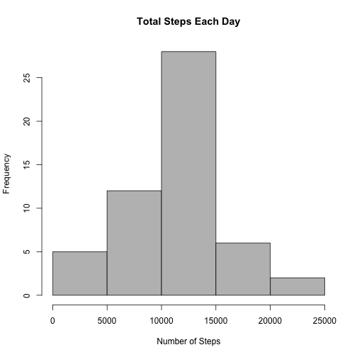
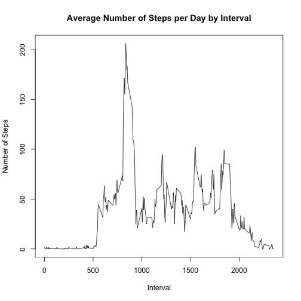
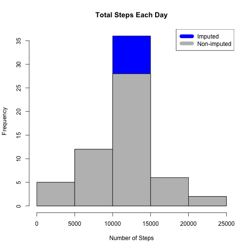
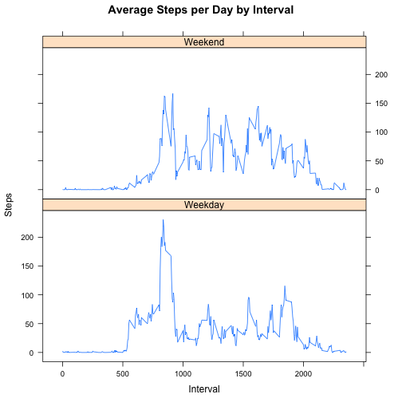

---
title: "Analyzing Activity Monitoring Device Data"
author: "Damian"
date: "7/15/2020"
output:
    html_document:
      keep_md:true
    ---

Plotting the mean total number of steps taken per day


```r
knitr::opts_chunk$set(echo = TRUE)
# Read data
repdata <- read.csv("activity.csv")  
steps_day <- aggregate(steps ~ date, repdata, sum)
hist(steps_day$steps, main = paste("Total Steps Each Day"), col="gray",xlab="Number of Steps")
```



Mean and Median


```r
knitr::opts_chunk$set(echo = TRUE)
repmean <- mean(steps_day$steps)
repmean
```

```
## [1] 10766.19
```


```r
knitr::opts_chunk$set(echo = TRUE)
repmedian <- median(steps_day$steps)
repmedian
```

```
## [1] 10765
```

Plotting the average daily activity pattern


```r
knitr::opts_chunk$set(echo = TRUE)
steps_interval <- aggregate(steps ~ interval, repdata, mean)
plot(steps_interval$interval,steps_interval$steps, type="l", xlab="Interval", ylab="Number of Steps",main="Average Number of Steps per Day by Interval")
```



Max Interval revealed


```r
knitr::opts_chunk$set(echo = TRUE)
max_interval <- steps_interval[which.max(steps_interval$steps),1]
max_interval
```

```
## [1] 835
```

Calculate and report the total number of missing values in the dataset


```r
knitr::opts_chunk$set(echo = TRUE)
NATot <- sum(!complete.cases(repdata))
NATot
```

```
## [1] 2304
```

Using Mean for the day compute missing values and creating a new dataset.
Making the histogram of the total number of steps taken each day.


```r
knitr::opts_chunk$set(echo = TRUE)
StepsAverage <- aggregate(steps ~ interval, data = repdata, FUN = mean)
fillNA <- numeric()
for (i in 1:nrow(repdata)) {
  obs <- repdata[i, ]
  if (is.na(obs$steps)) {
    steps <- subset(StepsAverage, interval == obs$interval)$steps
  } else {
    steps <- obs$steps
  }
  fillNA <- c(fillNA, steps)
}
new_activity <- repdata
new_activity$steps <- fillNA
TotalSteps <- aggregate(steps ~ date, data = new_activity, sum, na.rm = TRUE)
hist(TotalSteps$steps, main = paste("Total Steps Each Day"), col="blue", xlab="Number of Steps")
#Create Histogram to show difference. 
hist(steps_day$steps, main = paste("Total Steps Each Day"), col="gray", xlab="Number of Steps", add=T)
legend("topright", c("Imputed", "Non-imputed"), col=c("blue", "gray"), lwd=10)
```



Calculating the mean and median total number of steps taken per day.


```r
knitr::opts_chunk$set(echo = TRUE)
repmeantotal <- mean(TotalSteps$steps)
repmeantotal
```

```
## [1] 10766.19
```


```r
knitr::opts_chunk$set(echo = TRUE)
repmediantotal <- median(TotalSteps$steps)
repmediantotal
```

```
## [1] 10766.19
```

Showing if median and mean values differ from the estimates from the first part.


```r
knitr::opts_chunk$set(echo = TRUE)
mediandiff <- repmediantotal - repmedian
mediandiff
```

```
## [1] 1.188679
```

```r
meandiff <- repmeantotal - repmean
meandiff
```

```
## [1] 0
```
The mean is the same and the median has a variance (Var:1.1886792).

Plotting differences in activity patterns between weekdays and weekends.


```r
knitr::opts_chunk$set(echo = TRUE)
weekdays <- c("Monday", "Tuesday", "Wednesday", "Thursday", "Friday")
new_activity$dow = as.factor(ifelse(is.element(weekdays(as.Date(new_activity$date)),weekdays), "Weekday", "Weekend"))
TotalSteps <- aggregate(steps ~ interval + dow, new_activity, mean)
library(lattice)
xyplot(TotalSteps$steps ~ TotalSteps$interval|TotalSteps$dow, main="Average Steps per Day by Interval",xlab="Interval", ylab="Steps",layout=c(1,2), type="l")
```


